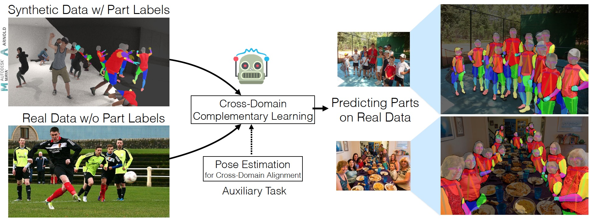

# CDCL

This is the code repository for the paper:  
**Cross-Domain Complementary Learning Using Pose for Multi-Person Part Segmentation**  
Kevin Lin, Lijuan Wang, Kun Luo, Yinpeng Chen, Zicheng Liu, Ming-Ting Sun

[[PDF](https://ieeexplore.ieee.org/document/9094232)] [[arXiv](https://arxiv.org/abs/1907.05193)] [[Demo Video](https://youtu.be/8QaGfdHwH48)] [[ICCV2019 Demo Poster](https://www.dropbox.com/s/zq1rtci6yiv1iqi/iccv19-demo-poster.pdf?dl=0)]

We address the problem of learning multi-person part segmentation without human labeling. Our proposed complementary learning technique learns a neural network model for multi-person part segmentation using a synthetic dataset and a real dataset. We observe that real and synthetic humans share a common skeleton structure. During learning, the proposed model extracts human skeletons which effectively bridges the synthetic and real domains. Without using human-annotated part segmentation labels, the resultant model works well on real world images.

## Citing paper
If you find CDCL useful for your research, please consider citing:

	@article{lin2020cross,
	  Title    = {Cross-Domain Complementary Learning Using Pose for Multi-Person Part Segmentation},
	  Author   = {Lin, Kevin and Wang, Lijuan and Luo, Kun and Chen, Yinpeng and Liu, Zicheng and Sun, Ming-Ting},
	  Journal  = {IEEE Transactions on Circuits and Systems for Video Technology},
	  Year     = {2020}
	}

        or

	@article{lin2019cross,
	  Title    = {Cross-Domain Complementary Learning with Synthetic Data for Multi-Person Part Segmentation},
	  Author   = {Lin, Kevin and Wang, Lijuan and Luo, Kun and Chen, Yinpeng and Liu, Zicheng and Sun, Ming-Ting},
	  Journal  = {arXiv preprint arXiv:1907.05193},
	  Year     = {2019}
	}

## Installation instructions
Our codebase is developed based on Ubuntu 16.04 LTS, CUDA 9.0, CUDNN 7.0, Tensorflow 1.12.0, Keras 2.1.1.

### Anaconda

We suggest creating a new conda environment for setting up the relevant dependencies. After installing [Anaconda](https://docs.anaconda.com/anaconda/install/linux/) on your machine, please run the following command:

    $ conda env create -f cdcl_environment.yaml

After creating the environment, you just need to activate the environment and continue running the demo code.  

    $ conda activate cdcl

### Docker

Alternatively, we provide the `Dockerfile` which can be used to build a docker image with all dependencies pre-installed. You can find the `Dockerfile` in the folder [docker](https://github.com/kevinlin311tw/CDCL-human-part-segmentation/blob/master/docker). After installing [Docker](https://docs.docker.com/install/linux/docker-ce/ubuntu/) and [Nvidia-Docker2](https://github.com/NVIDIA/nvidia-docker/wiki/Installation-(version-2.0)), please go to the folder `docker`, and run the following command to build the docker image:

    $ sudo docker build -t cdcl:v1 .
 
After this, you can test your docker image on your machine

    $ sudo docker run --runtime=nvidia -v PathA:PathB -it cdcl:v1 bash

It is important to note that this command will mount a local folder in the docker container. 
`PathA` is the folder path of this repo in your machine. 
`PathB` is the target folder path in the container.

### Other install solution
If Anaconda and Docker do not work well on you machine, we list the required packages as below for you to manually install the dependencies.

    $ sudo apt-get -y update
    $ sudo apt-get -y install libboost-all-dev libhdf5-serial-dev libzmq3-dev libopencv-dev python-opencv git vim
    $ sudo pip install Cython scikit-image keras==2.1.1 configobj IPython
    $ sudo apt-get -y install python-tk python3-pip python3-dev python3-tk cuda-toolkit-9-0
    $ sudo pip3 install tensorflow-gpu==1.12.0
    $ sudo pip3 install keras==2.1.1 Cython scikit-image pandas zmq h5py opencv-python IPython configobj cupy-cuda90

## Fetch data

To run our code, you need to also fetch some additional files. Please run the following command:

    $ bash fetch_data.sh

This script will fetch two pretrained neural network models. In this demo script, we provide a pretrained model, which is firstly trained on COCO2014 and our multi-person synthetic data, and then fine-tuned on PASCAL-Person-Part dataset. 

This pre-trained model predcits 6 body parts in the images, and achieves 72.82% mIOU on PASCAL-Person-Part dataset. We denote this model as `CDCL+PASCAL` in our paper.

We also provide a pre-trained model, which predicts 15 body parts in the image. This model is trained without real data labels. We denote this model as `CDCL` in our paper.

### Download files manually
If the script does not work well on your machine, you could manually download the pre-trained weights through the following links. Please unzip the downloaded files, and put the pre-trained weights in the folder `weights`

Model weights for 6 body parts: [Dropbox](https://www.dropbox.com/s/6ttxi3vb6e7kx4t/cdcl_pascal_model.zip?dl=0) [GoogleDrive](https://drive.google.com/file/d/1OvI8P0S737A0ryrSC3Dw9_KbmDT5Mw-k/view?usp=sharing)

Model weights for 15 body parts: [Dropbox](https://www.dropbox.com/s/sknafz1ep9vds1r/cdcl_model.zip?dl=0) [GoogleDrive](https://drive.google.com/file/d/1R_uqMwkAGf8xK9RXEwvHoEkMeE_iOphf/view?usp=sharing)

## Run the inference code

This demo runs multi-person part segmentation on the test images. In order to run the inference code, you need to put your testing images in the folder [input](https://github.com/kevinlin311tw/CDCL-human-part-segmentation/blob/master/input). Our inference code will iterate all images in the folder, and generate the results in the folder [output](https://github.com/kevinlin311tw/CDCL-human-part-segmentation/blob/master/output). 

We provide 2 different ways to use our inference code. Here are the example usages:

For single-scale inference, please run the following command

    $ python3 inference_7parts.py --scale=1

You may also like to run the following command for multi-scale inference for more accurate results

    $ python3 inference_7parts.py --scale=1 --scale=0.5 --scale=0.75

For 15 parts prediction, please run the following command

    $ python3 inference_15parts.py --scale=1

Similarly, you can run the following command for multi-scale inference for more accurate results

    $ python3 inference_15parts.py --scale=1 --scale=0.5 --scale=0.75

## Training

The traing code is developed based on our previous repo [keras-openpose-reproduce](https://github.com/kevinlin311tw/keras-openpose-reproduce)

The proposed training code and the synthetic data will be released after company approval.

## Contact
Please feel free to leave suggestions or comments to Kevin Lin (kvlin@uw.edu), Lijuan Wang (lijuanw@microsoft.com), Zicheng Liu (zliu@microsoft.com), Ming-Ting Sun (mts@uw.edu)
